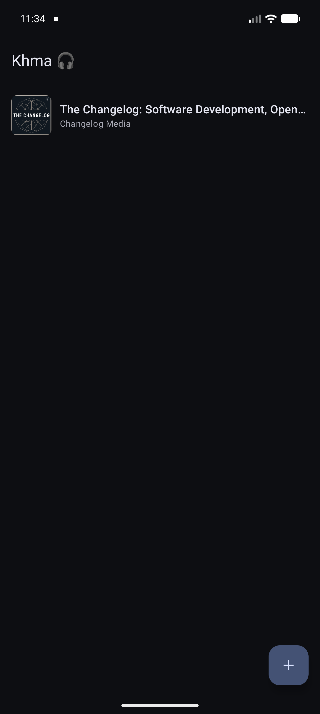
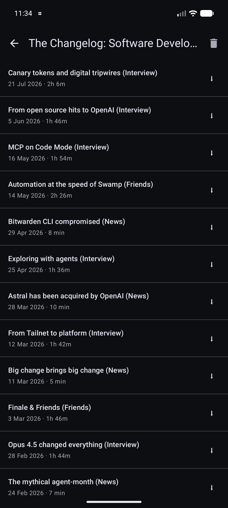
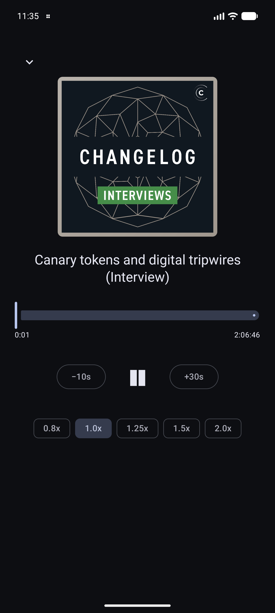

# Khma 🎧

**ხმა** (*khma* — Georgian for "sound / voice") — a clean, offline-friendly
**podcast player** for Android.

Subscribe to any podcast by its RSS feed, stream or download episodes, and keep
listening with the screen off — background playback with lock-screen controls,
built on **Media3 / ExoPlayer**.

## Screenshots

| Library | Episodes | Now playing |
|:---:|:---:|:---:|
|  |  |  |

## Features

- 📡 **Subscribe by RSS** — paste any podcast feed URL; the channel and its
  episodes are parsed and stored locally.
- ▶️ **Background playback** — Media3 `ExoPlayer` in a `MediaSessionService`, with
  notification / lock-screen controls, audio focus, and headset-button handling.
- ⏱️ **Resume where you left off** — per-episode position is persisted and restored.
- ⏬ **Offline downloads** — download an episode's audio with `WorkManager`
  (progress + retry); playback prefers the local file and works with no network.
- 🎚️ **Now-playing controls** — draggable seek bar, skip ±10s/30s, variable speed
  (0.8×–2×), and episode artwork.
- 🎨 **Material 3** — dynamic color, light/dark, edge-to-edge.

## Tech

Single-module Android app: **Jetpack Compose** + Material 3, **Media3** (ExoPlayer +
MediaSession) for playback, **Room** (+ KSP) for subscriptions/episodes and playback
state, **WorkManager** for downloads, **OkHttp** for networking, a DOM-based
`RssParser` for feeds, and **Coil** for artwork.

- Gradle 9.3.1 · AGP 9.1.1 · Kotlin 2.3.21 · Compose BOM 2026.06.01
- compileSdk 36 · minSdk 26

## Structure

```
data/     Room entities/DAO, RSS fetching + parsing, downloads, repository
playback/ Media3 MediaSessionService + MediaController-backed PlayerViewModel
ui/       Compose library, episode list, mini-bar, now-playing screen
```

## Build & run

```bash
git clone https://github.com/Meko123456/Khma.git
cd Khma
./gradlew :app:assembleDebug     # or open in Android Studio and Run
```

Then add a feed — for example `https://changelog.com/podcast/feed` — tap an
episode to stream, or the ⬇ button to download for offline listening.

## Status

✅ **v0.1.0** — subscriptions, background playback, resume, downloads/offline,
and the now-playing screen are all working. See [issues](../../issues) for what's next.

## License

[MIT](LICENSE)
